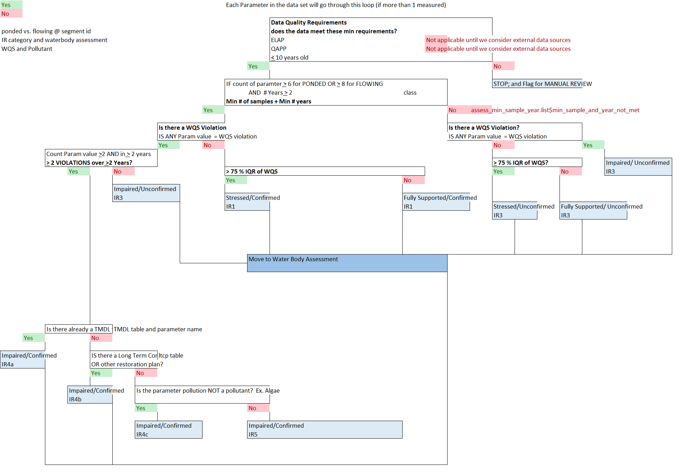
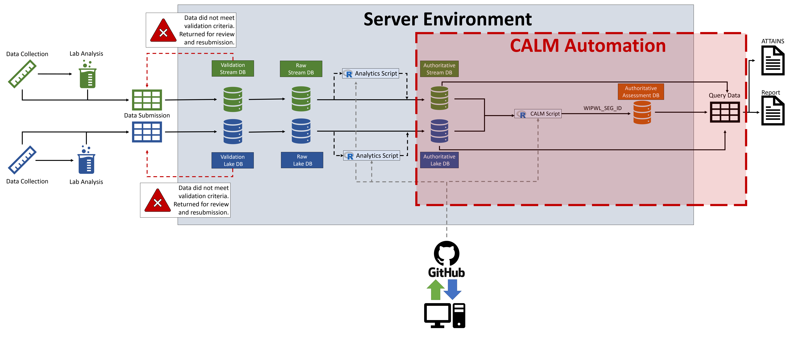

# CALM

The NYSDEC maintains a CALM that describes the processes and procedures used to assess the quality of New York’s surface waters and determine the attainment status in each waterbody consistent with applicable water quality standards and guidance values. The following dichotomous key and Figure \@ref(fig:calm-tree) provide two ways of simplifying the assessment process outlined in the CALM. The assessments are used by New York state for management purposes and ultimately reported to the United State Environmental Protection Agency (USEPA) in the form of a 303d list.

- Dichotomous Key
    + 1a.) The following requirements are __NOT__ met:
        + ELAP certified lab used for analytics (Not applicable until we consider external data sources)
        + Project has an approved QAPP (Not applicable until we consider external data sources)
        + < 10 years old (`assessment_period()`; `within_assess_period == FALSE`)
            + __Requires manual review__
    + 1b.) The above requirements are met (`assessment_period()`; `within_assess_period == TRUE`) [2]
    + 2a.) Does not meet the required minimum number of samples or minimum number of years for assessment. (`assessment_min_req()`; `min_req_met == FALSE`) [3]
    + 2b.) Meets the required minimum number of samples and minimum number of years for assessment. (`assessment_min_req()`; `min_req_met == TRUE`) [5]
    + 3a.) There is a Water Quality Standard violation
        + __Classify as Impaired/Unconfirmed IR3__
    + 3b.) There is no Water Quality Standard violation [4]
    + 4a.) >= 75% IQR of Water Quality Standard
        + __Classify as Stressed/Unconfirmed IR3__
    + 4b.) < 75% IWR of Water Quality Standard
        + __Classify as Fully Supported/Unconfirmed IR3__
    + 5a.) There is a Water Quality Standard violation [7]
    + 5b.) There is no Water Quality Standard violation [6]
    + 6a.) >= 75% IQR of Water Quality Standard
        + __Classify as Stressed/Confirmed IR1__
    + 6b.) < 75% IWR of Water Quality Standard
        + __Classify as Fully Supported/Confirmed IR1__
    + 7a.) >= 2 violations over >= 2 years [8]
    + 7b.) < 2 violations over >= 2 years
        + __Classify as Impaired/Unconfirmed IR3__
    + 8a.) A TMDL exists for the parameter
        + __Classify as Impaired/Confirmed IR4__
    + 8b.) A TMDL does not exist for the parameter [9]
    + 9a.) A Long Term Consent order or another restoration plan exists
        + __Classify as Impaired/Confirmed IR4b__
    + 9b.) A Long Term Consent order or another restoration plan do not exist [10]
    + 10a.) The parameter is considered a pollutant
        + __Classify as Impaired/Confirmed IR4c__
    + 10b.) The parameter is not considered a pollutant
        + __Classify as Impaired/Confirmed IR5__

```{r calm-tree, fig.align='center', echo=FALSE, fig.cap="A decision tree to vizualize the assessment process as defined in the NYSDEC CALM."}

```

## Data Modernization

BWAM is piloting the Division of Water's (DOW's) Data Modernization effort in partnership with the New York State Office of Information Technology Services (ITS) which will create a robust data workflow for all BWAM related data (Figure \@ref(fig:bwam-flow)). Progress of the Data Modernization and Automation of Assessment projects are not dependent upon one another, but these projects are not mutually exclusive. The process developed for the Automation of Assessment will ultimately be inserted in the data workflow produced by the Data Modernization project (Figure \@ref(fig:bwam-flow)). Furthermore, the Data Modernization effort will ultimately produce the authoritative data repositories, in the form of Oracle databases, necessary for automating assessments. No definitive deadline has been establish for the completion of the authoritative Oracle databases; however, the Data Modernization development process has forced the Stream Monitoring and Assessment Section (SMAS), the Lake Monitoring and Assessment Section (LMAS), and the Water Assessment and Implementation Section (WAIS) to begin to compile, re-structure, and re-format their data sets into interim-databases in preparation for the creation of these authoritative Oracle databases. These interim-databases will serve as the current authoritative databases with the expectation that there will be changes to the structure and format of the data once the Oracle databases are finalized, but these changes will be relatively minor. Attempting to align these two efforts as much as possible should ultimately be cost effective, because these two efforts have the potential to be mutually beneficial.

```{r bwam-flow, fig.align='center', echo=FALSE, fig.cap="An overview of New York State Department of Environmental Conservation's (NYSDEC's) Bureau of Water Assessment and Management (BWAM) data workflow. The portion of the process surrounded by the red dotted box is most relavent to the automation of assessments. Within the red box are two authoratative database (i.e., the authoratative stream and lake databases) for storing observed water quality variables. Relavent observed values are quired out of these authoratitative databases and processed with an R-script applying CALM logic to assess waterbodies. The assessments produced by the R-script are stored within the authoratative Assessment database, which can be subsequently queried for reporting purposes."}

```

