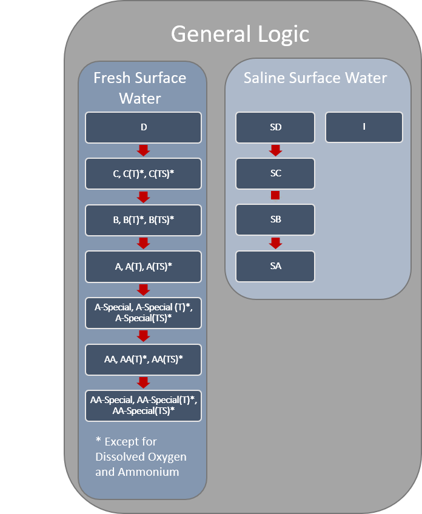
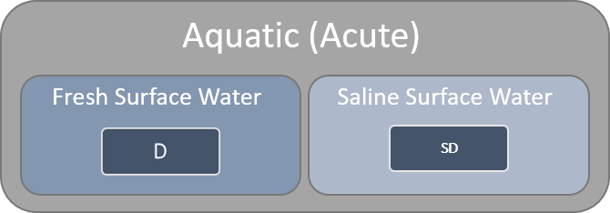
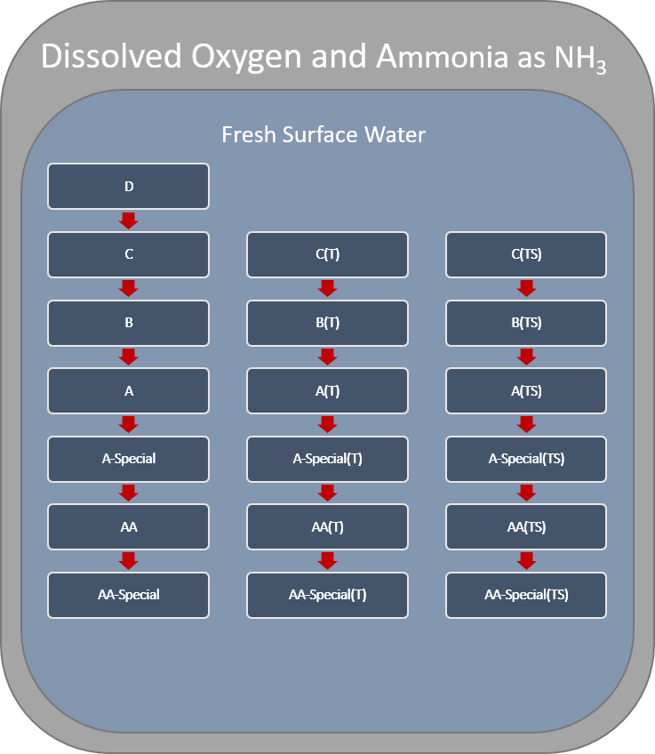
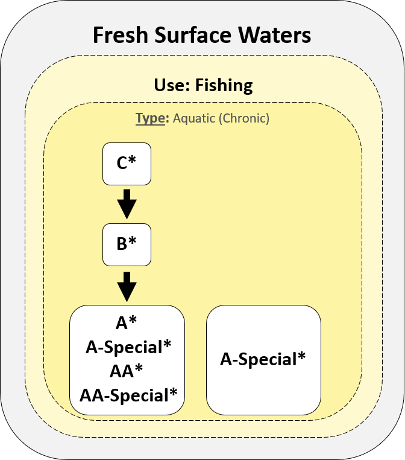
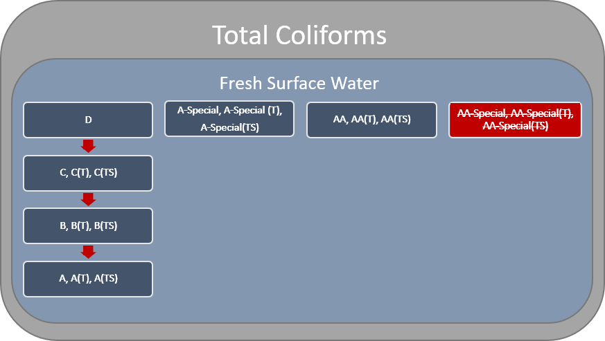
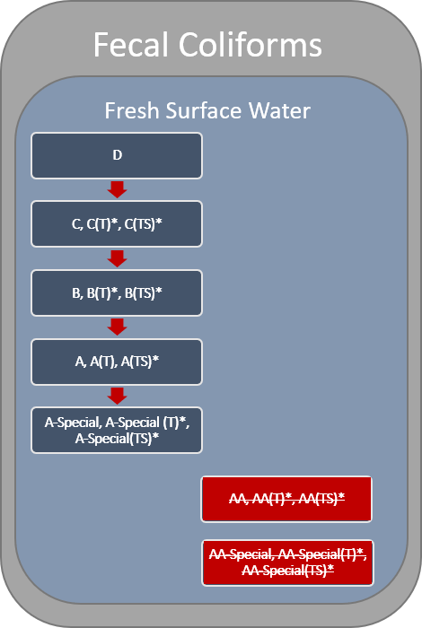

# Water Quality Standards

Data was preprocessed to resemble the expected output from the athorotative databases that will become available as part of the Data Modernization effort [Data Modernization].
```{r}
data(nysdec_wqs)
```

## Waterbody Class Hierarchy

Fresh and Saline Surface Water classes generally conform to a descending alphabetical hierarchy (Figure \@ref(fig:wqs-general)).The saline surface water class I's are only associated with secondary contact recreation and fishing, and therefore are treated independently of the other saline surface water classes. WQS assigned to upstream classes are applicable to all downstream classes. The most upstream class associated with a WQS will be refered to as the "root" class for a given standard. For example, WQS with a root of D and SD classes will be applicable to all downstream fresh surface water classes (i.e., C, B, A, A-Special, AA, AA-Special, and their associated Trout (T) and Trout Spawning (TS) variants) and saline surface water classes (i.e., SC, SB, and SA), respectively. In many instances, the WQS become increasingly more restrictive moving downstream through the hierarchy. D and SD represent the most upstream classes in fresh and saline surface waters, respectively, and therefore influence all other classes. However, D and SD classes do not always represent the root class for a given WQS.


```{r wqs-general, fig.align='center', echo=FALSE, fig.cap="."}

```

    


```{r wqs-aa, fig.align='center', echo=FALSE, fig.cap="Many water quality standards of type, Aquatic (Acute), are only applicable for fresh and saline surface waters D and SD, respectively. Therefore, Aquatic (Acute) standards are not always inherited by the classes downstream of D and SD in their respective hierarchies. There is no standaridized logic dictating when Aquatic (Acute) water quality standards are or are not inherited by their descendants."}

```


```{r wqs-do-ammonia, fig.align='center', echo=FALSE, fig.cap=""}

```

```{r wqs-dissolved-solids, fig.align='center', echo=FALSE, fig.cap=""}

```


```{r wqs-total-coliforms, fig.align='center', echo=FALSE, fig.cap=""}

```


```{r wqs-fecal-coliforms, fig.align='center', echo=FALSE, fig.cap=""}

```


## Waterbody Uses

